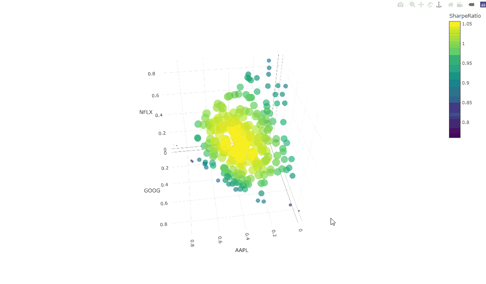

# Portfolio Optimization and Performance Analysis

## Description
This project provides a tool for portfolio optimization and performance analysis using historical stock data. The script retrieves stock price data, calculates Sharpe ratios, builds a custom portfolio, generates random portfolio weights, and visualizes the results using `plotly` with a 3D plot.

## Visualization Example
Here's an example of the 3D plot generated by this script:



This GIF demonstrates how different combinations of stock weights affect the portfolio's performance, as measured by the Sharpe ratio.

## Setup and Running the Script
1. Ensure you have R and RStudio installed on your system.
2. Clone this repository or download the R script.
3. Open RStudio and set your working directory to where the R script is located.
4. Run the script to:
   - Retrieve stock data
   - Calculate portfolio returns
   - Generate random portfolio weights
   - Visualize the optimal portfolio

The script includes a package management section at the beginning:

```r
# List of required packages
required_packages <- c("tidyverse", "tidyquant", "furrr", "plotly")

# Install missing packages
for (lib in required_packages) {
    if (!require(lib, character.only = TRUE)) {
        install.packages(lib, dependencies = TRUE)
        library(lib, character.only = TRUE)
    }
}
```

This code will:
- Install any missing required packages.
- Automatically load all necessary libraries before running the analysis.

## Features
- Retrieves historical stock data for user-specified companies (default: AAPL, GOOG, NFLX).
- Calculates monthly returns and Sharpe ratios for selected stocks and a benchmark (default: XLK).
- Builds a custom portfolio with adjustable weights.
- Generates random portfolio weights and identifies the optimal portfolio based on Sharpe ratios.
- Visualizes portfolio performance using an interactive 3D plot.

## Usage
1. **Stock Selection:**
   - Replace default stock symbols (AAPL, GOOG, NFLX) with your own company's tickers in the code.
   - Update the section where stock components are retrieved:
   ```r
   returns_m_components_tbl <- c("AAPL", "GOOG", "NFLX") %>%
   ```
   
2. **Adjust Portfolio Weights:**
   - Modify the custom weights for the stocks:
   ```r
   wts_tbl <- returns_m_components_tbl %>%
       distinct(symbol) %>%
       mutate(weights = c(0.25, 0.25, 0.5))
   ```
   
3. **Random Portfolio Generation:**
   - The script generates 250 random portfolios by default. You can adjust the number of iterations as needed:
   ```r
   iter  <- 250
   ```

4. **Visualization:**
   - After running the script, an interactive 3D plot will visualize how stock weight combinations impact portfolio performance based on Sharpe ratios.

## Data
This project uses historical stock data retrieved from the `tidyquant` package, which pulls data directly from financial sources like Yahoo Finance. Ensure your internet connection is active when running the script to fetch the data.

## Contact
For any questions or issues, feel free to reach out:

**Rohan Jasani**